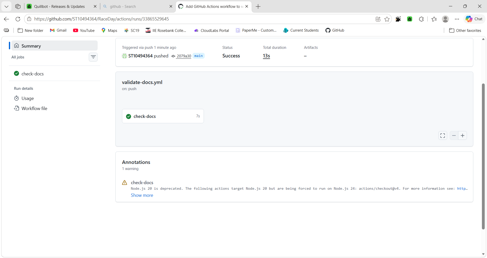

# RaceDay

RaceDay is a full-stack, web-based event management system built for the South African road running, walking, and cycling community. It replaces the paper-based registration and disconnected communication that many local events still rely on, giving Event Organisers a single platform to create and manage events, categories, and results, while Participants can browse events, enrol, and track their own results and history.

This project is an individual Portfolio of Evidence (POE), built progressively across three parts:

- **Part 1 — System Planning and Database**: ERD, API endpoint plan, and SQL database schema. *(current stage — no application code yet)*
- **Part 2 — RESTful API**: built in C#, connected to the database, with unit tests and CI/CD.
- **Part 3 — MVC Web Application**: consumes the API, integrates Azure Blob Storage, and is containerised with Docker.

## Roles

The system supports two distinct user roles:

- **Organiser** — can create, update, and delete events; define event categories; view all enrolments for their events; and capture participant results.
- **Participant** — can browse and view events and categories, enrol in an event under a chosen category, and view their own profile and results.

## Repository Structure

/docs → Planning artifacts for Part 1
- FINAL_ERD.drawio.png — Entity Relationship Diagram
- API_Endpoint_Plan.md — Full API endpoint plan
- RaceDay_Schema.sql — SQL script (schema + seed data)
- ci-success.png — CI/CD successful build screenshot

 The database design follows a normalised structure: a single `User` table (distinguishing Organisers and Participants via a `role` field) connects to `Event`, which in turn connects to `Category`, `Enrolment`, and `Result` — with `Enrolment` linking Participants, Events, and Categories together. 

/.github/workflows → CI/CD configuration
- validate-docs.yml — Validates /docs folder structure

## Part 1 — Setup Instructions

Part 1 contains no application code, so there is nothing to run. To review the planning artifacts:

1. Clone this repository or browse it directly on GitHub.
2. Open `/docs/FINAL_ERD.drawio.png` to view the database design.
3. Open `/docs/API_Endpoint_Plan.md` to view the full endpoint plan (renders as a formatted table on GitHub).
4. To run the SQL script yourself:
   - Open `/docs/RaceDay_Schema.sql` in SQL Server Management Studio (SSMS).
   - Run the full script against a SQL Server instance. It will drop and recreate the `RaceDay` database from scratch, create all 6 tables, and seed sample data.

## CI/CD

A GitHub Actions workflow (`.github/workflows/validate-docs.yml`) runs automatically on every push to `main`. It checks that the `/docs` folder exists and contains all three required planning files.

**Latest build status:**

## Video Walkthrough

An unlisted YouTube video walking through the ERD design decisions, the API endpoint plan, and a live run of the SQL script in SSMS:

https://youtu.be/OaIk2n3y3Wo

## AI Assistance Disclosure

AI assistance (Claude, by Anthropic) was used throughout the planning stage of this project. Specifically, it was used to:

- Explain unfamiliar concepts (e.g. 401 vs 403 HTTP status codes, SQL Server reserved words)
- Talk through and validate design decisions for the ERD (entity choices, relationship cardinality) and the API endpoint plan, based on the functional requirements in the brief
- Help troubleshoot GitHub repository setup, folder structure issues, and the GitHub Actions CI/CD workflow
- Draft an initial version of the SQL script structure, which was then reviewed, tested, and run personally in SSMS against a clean instance to confirm it works correctly

All final design decisions, the analysis of trade-offs (e.g. single User table vs separate Organiser/Participant tables), testing, and verification were done by me. I can explain and defend every choice made in this submission.

---
© 2026 — PROG6212 Portfolio of Evidence, Part 1
